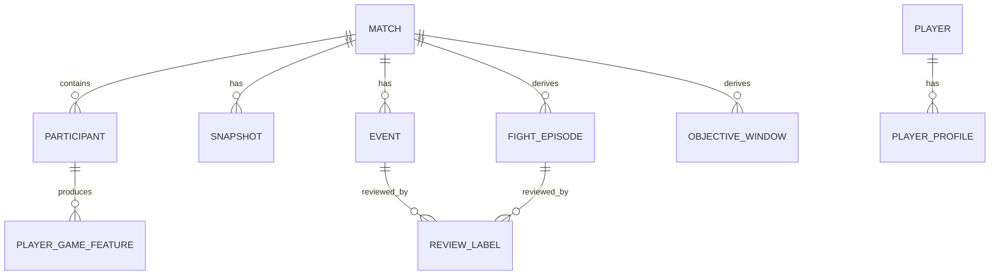
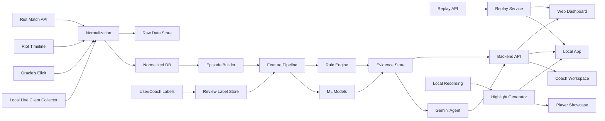

# LoL Player Insight Platform
### Professional Expansion Plan v3 — 개인 사용자 중심 전문 분석 보강판
## 프로 수준의 선수 분석 방식을 개인 사용자 경험에 적용하는 장기 확장 계획서

- 작성일: 2026-07-13
- 문서 목적: 현재 개발 중인 LoL 경기 분석 서비스를 개인 사용자 중심의 전문 분석 플랫폼으로 확장하기 위한 기술·제품 계획 수립
- 핵심 원칙: **지표는 판정이 아니라 복기 근거이며, 데이터가 설명하지 못하는 맥락은 리플레이·사용자·코치 검토로 연결한다.**
- 비전 분석 우선순위: **최종 확장 단계**
- 기본 대상: 솔로랭크 개인 사용자
- 확장 대상: 코치, 분석가, 아마추어 팀, 대회 시청자 및 중계 보조 환경


## 범위 원칙: 개인 분석이 중심이다

이 프로젝트는 전문적인 분석 방법을 사용하지만, 팀 구성이나 로스터 의사결정을 위한 시스템을 목표로 하지 않는다.

### 포함하는 범위

- 사용자의 경기별 퍼포먼스
- 포지션과 챔피언 조건을 고려한 기대치 대비 성과
- 성장, 자원 활용, 교전 결과, 위험 노출, 오브젝트 준비
- 여러 경기에서 반복되는 개인 패턴
- 대표 경기·최고 경기·평소와 달랐던 경기
- 개인의 최근 폼과 개선 추세
- 리플레이 복기와 AI·코치 리뷰 연결
- 프로 선수 경기 데이터를 활용한 기준선 및 참고 비교

### 제외하는 범위

- 팀 적합도 점수
- 로스터 조합 추천
- 선수 간 시너지 점수
- 개인 행동 이후의 관측 결과를 개인 능력으로 환산하는 지표
- 상대 성장 억제를 개인의 절대 능력으로 단정하는 지표
- 정글·서포터 인접률이나 원딜·서포터 듀오 인접률을 능력치로 사용하는 방식
- 팀 전술 수행 능력, 보이스, 리더십, 콜 수행을 자동 점수화하는 방식

팀 전체 골드, 팀 피해량, 승패, 오브젝트 결과는 제거하지 않는다. 다만 이는 **개인의 자원 점유율과 결과를 해석하기 위한 비교 기준 및 상황 변수**로만 사용한다. 예를 들어 `TeamGold`는 팀을 평가하는 지표가 아니라, 경기 전체 골드 중 사용자가 차지한 비율을 나타내는 개인 맥락 변수로 사용한다.

---

## 1. 프로젝트 한 문장 정의

> 사용자의 LoL 경기 데이터를 자동 수집하고, 프로 경기 분석에서 사용하는 역할별 비교·상황 보정·경기 상태 변화·장기 추세 분석 방식을 적용해 반복 패턴과 주요 장면을 찾아주며, 사용자가 직접 복기하거나 AI 분석 및 전문 코치 리뷰로 확장할 수 있도록 지원하는 경기 분석 플랫폼.

이 프로젝트는 다음 세 가지 중 어느 하나로만 정의하지 않는다.

- 단순 전적 조회 사이트가 아니다.
- AI가 사용자의 플레이를 정답·오답으로 판정하는 코칭 사이트가 아니다.
- 프로 선수만을 대상으로 하는 스카우팅 도구가 아니다.

대신 하나의 공통 데이터 엔진 위에 다음 경험을 제공한다.

1. **개인 사용자 경험**
   - 경기 자동 수집
   - 경기 흐름과 주요 변곡점 확인
   - 최근 경기 기반 퍼포먼스 프로필
   - 대표 경기·최고 경기·평소와 달랐던 경기 비교
   - 리플레이 중계 모드
   - 자동 하이라이트와 대표 하이라이트 프로필
   - 선택형 AI 복기

2. **코치 연결 경험**
   - 사용자의 반복 패턴과 대표 장면을 묶은 분석 패키지
   - 코치의 리플레이 검토, 장면 태그, 메모
   - 자동 분석에 대한 수정 라벨 축적

3. **프로·대회 선수 분석 확장**
   - 프로 경기 기준선
   - 포지션별 퍼포먼스 모델
   - 경기·세트·대회에서의 선수별 성과 흐름
   - 선수별 장기 성과와 플레이 스타일 비교
   - 분석가가 특정 선수의 근거 경기와 장면을 빠르게 찾는 워크벤치

---

# 2. 제품 철학

## 2.1 지표는 능력의 절대 측정값이 아니다

`라인전 82`, `한타 76`, `운영 69`와 같은 숫자는 선수의 고정된 능력을 직접 측정한 값이 아니다. 실제로는 다음 조건에서 반복적으로 관측된 퍼포먼스를 요약한 **상대적 추정치**다.

- 포지션
- 챔피언과 상대 챔피언
- 패치
- 티어 또는 대회 수준
- 진영
- 경기 시간
- 팀의 자원 분배
- 상대 수준
- 표본 수

따라서 사용자 화면의 명칭은 초기에는 `능력치`보다 다음 표현을 권장한다.

- 최근 경기 퍼포먼스 프로필
- 플레이 경향
- 동일 포지션 비교 지표
- 최근 폼 프로필

## 2.2 관측과 해석을 분리한다

모든 분석 결과는 아래 네 층으로 분리한다.

### 확인된 사실

> 18분 42초에 사용자가 사망했고, 47초 뒤 상대 팀이 드래곤을 획득했다. 같은 구간에서 팀 골드 차이는 +700에서 -400으로 변했다.

### 해석 후보

> 오브젝트 준비 구간에서 위험 노출이 컸을 가능성이 있다.

### 분석 한계

> 상대 체력, 핵심 스킬·소환사 주문 소모, 팀의 실제 교전 의도는 확인할 수 없다.

### 복기 항목

> 사망 20초 전부터 아군 위치, 상대 노출 인원, 웨이브 상태를 리플레이에서 확인한다.

분석 문구는 다음 원칙을 따른다.

| 피해야 할 문구 | 권장 문구 |
|---|---|
| 이 데스 때문에 용을 잃었다 | 이 사망 후 47초 이내 드래곤 손실이 관측됐다 |
| 운영 판단이 나쁘다 | 오브젝트 전 위험 노출이 반복되는 경향이 있다 |
| 봇 진입 습관이 문제다 | 봇 외곽·강가 구역에서 사망이 집중됐다 |
| 다음에는 무조건 싸우지 마라 | 해당 장면에서 아군 위치와 진입 목적을 먼저 확인해 볼 수 있다 |

## 2.3 자동 분석은 리플레이 검토 대상을 줄인다

이 프로젝트가 전문적으로 보이기 위해 가장 중요한 역할은 다음과 같다.

> 수십 경기 전체를 사람이 처음부터 보는 대신, 데이터가 검토 우선순위가 높은 경기와 장면을 먼저 선별한다.

자동 시스템의 최종 출력은 `좋은 데스/나쁜 데스` 판정이 아니라 다음과 같아야 한다.

- 반복적으로 나타나는 사건
- 평소와 차이가 큰 경기
- 지표 변화에 크게 기여한 장면
- 데이터만으로 결론을 내리기 어려운 장면
- 리플레이에서 확인할 질문

---

# 3. 핵심 사용자 시나리오

## 3.1 일반 사용자

1. 사용자가 Riot ID를 등록한다.
2. Riot API를 통해 최근 경기와 타임라인을 수집한다.
3. 사용자가 로컬 앱을 설치한 경우 Live Client Data API를 추가 수집한다.
4. 경기 종료 후 데이터 정규화와 분석 작업이 자동 실행된다.
5. 사용자는 다음 결과를 확인한다.
   - 경기 흐름
   - 주요 변곡점
   - 사건별 확인된 결과
   - 경기 퍼포먼스
   - 최근 반복 패턴
   - 대표 경기·최고 경기·이탈 경기
   - 복기할 리플레이 장면
6. 사용자가 원할 때만 AI 상세 분석을 생성한다.
7. 사용자가 필요하면 분석 패키지를 코치에게 공유한다.

## 3.2 코치 리뷰

1. 사용자가 최근 경기 중 질문할 경기와 장면을 선택한다.
2. 시스템이 자동으로 다음 자료를 묶는다.
   - 최근 퍼포먼스 프로필
   - 반복 패턴
   - 대표 경기
   - 최고 퍼포먼스 경기
   - 평소와 달랐던 경기
   - 검토 우선 장면
   - 사용자 질문
3. 코치는 리플레이와 데이터를 함께 확인한다.
4. 코치는 장면에 태그와 메모를 남긴다.
5. 수정된 코치 라벨은 향후 분석 규칙과 ML 학습 데이터로 축적한다.

## 3.3 대회·프로 데이터 보기

일반 사용자가 대회 선수의 경기 기록을 볼 때도 같은 구조를 사용한다.

- 포지션별 프로 기준선
- 경기별 퍼포먼스
- 최근 대회 폼
- 대표 경기와 이탈 경기
- 지표가 크게 드러난 VOD 구간
- 경기·세트 단위 우세도 흐름
- 장기 성과 변화

선수 선발이나 팀 구성 기능은 범위에서 제외하고, 프로 경기 데이터는 개인 선수 분석 방법을 검증하고 기준선을 만드는 데 활용한다.

---

# 4. 데이터 수집 전략

## 4.1 데이터 소스 역할 분리

| 데이터 소스 | 대상 | 시간 해상도 | 주된 용도 | 주요 한계 |
|---|---|---:|---|---|
| Riot Match API | 일반 사용자 경기 | 경기 단위 | 최종 통계, 아이템, 결과, 참가자 정보 | 세부 맥락 부족 |
| Riot Match Timeline | 일반 사용자 경기 | 프레임·이벤트 단위 | 킬·데스·오브젝트·위치·성장 흐름 | 스킬·체력·팀 콜을 완전히 알 수 없음 |
| Live Client Data API | 앱 설치 사용자의 진행 중 경기 | 로컬 폴링 주기 | 내 상태, 경기 이벤트, 실시간 상태 저장 | 전체 선수의 모든 정보가 제공되지는 않음 |
| Oracle’s Elixir CSV | 프로 경기 | 경기·제공 컬럼 단위 | 프로 기준선, 포지션 모델, 장기 분석 | 일반 솔로랭크와 환경이 다름 |
| Replay API | 사용자가 보유한 리플레이 | 재생 시간 단위 | 특정 장면 이동, 재생 제어, 녹화 | 장면의 의미를 자동 판정하지 않음 |
| 로컬 녹화 영상 | 앱 설치 사용자 | 프레임 단위 | 하이라이트, 최종 비전 분석 | 저장·연산·라벨링 비용 |
| 코치·사용자 라벨 | 검토된 장면 | 사건 단위 | 자동 분석 검증 및 지도학습 정답 | 초기 라벨 수 부족, 평가자 차이 |

## 4.2 Riot Match API 및 Timeline 수집

### 수집 항목

- match ID
- patch/version
- queue type
- game duration
- participant ID 및 Riot ID
- team, role, champion
- K/D/A
- gold, CS, XP 관련 통계
- damage, damage taken
- vision
- items
- objectives
- participant frames
- champion kill events
- elite monster events
- tower events
- item purchase events
- position fields
- shutdown 관련 이벤트·필드
- 게임 결과

### 수집 방식

```text
사용자 Riot ID 등록
→ PUUID 조회
→ 최근 match ID 수집
→ match detail 저장
→ timeline 저장
→ 원본 JSON 보존
→ 정규화 테이블 적재
→ feature 생성 작업 등록
```

### 원본 데이터 보존 원칙

정규화한 값만 저장하면 분석 방식이 바뀔 때 다시 API를 호출해야 한다. 따라서 다음 두 계층을 모두 둔다.

```text
raw_match_json
raw_timeline_json
        ↓
normalized tables
        ↓
derived features
```

- 원본 JSON에는 스키마 버전을 기록한다.
- feature에는 계산 버전을 기록한다.
- 분석 규칙을 수정해도 원본에서 재생성할 수 있어야 한다.

## 4.3 Live Client Data API 로컬 수집기

Riot 공식 문서상 Game Client API는 로컬 네이티브 애플리케이션에서 접근하며, Live Client Data API는 진행 중 경기의 일반 정보와 플레이어 데이터를 제공한다. `/allgamedata`는 테스트에는 편리하지만 필요한 하위 엔드포인트를 사용하는 방식이 권장된다.

### 권장 폴링 전략

```text
매 1초
- game time
- active player 핵심 상태
- eventdata 신규 이벤트 확인

매 3~5초
- playerlist
- gamestats
- 아이템·스코어 변화

중요 이벤트 발생 시
- 해당 시점 전체 상태 스냅샷
- 녹화 타임코드
- 전후 구간 고주기 저장 플래그
```

### 로컬 수집기 컴포넌트

```text
Process Detector
- League 게임 실행 감지

Live API Poller
- HTTPS localhost 호출
- 자체 서명 인증서 처리
- 엔드포인트별 주기 관리

Event Cursor
- 마지막 EventID 저장
- 신규 이벤트만 추가

Local Session Store
- SQLite 또는 로컬 파일 큐
- 네트워크 장애 시 임시 저장

Sync Worker
- 경기 종료 후 서버 업로드
- 중복 방지
- retry/backoff

Match Reconciler
- 로컬 session과 Riot match ID 연결
```

### 로컬 앱에서 저장할 최소 스냅샷

```json
{
  "local_session_id": "20260713-001",
  "game_time": 842.3,
  "active_player": {
    "level": 11,
    "current_gold": 1340,
    "health": 1260,
    "max_health": 1850,
    "resource": 510
  },
  "event_cursor": 17,
  "collector_version": "0.1.0"
}
```

### 중요한 제한

Live Client API를 1초마다 호출하더라도 다음 정보가 모두 확보되는 것은 아니다.

- 전체 선수의 정확한 체력과 모든 위치
- 전체 스킬 쿨타임
- 시야 밖 상대 위치
- 팀의 의도와 보이스
- 웨이브 전체 상태
- 사망의 전략적 가치

따라서 Live Client는 Timeline을 대체하는 것이 아니라 **설치 사용자에게 더 촘촘한 추가 신호를 제공하는 계층**이다.

## 4.4 Oracle’s Elixir 프로 경기 수집

Oracle’s Elixir는 여러 지역 프로 리그의 경기 CSV를 제공한다. 해당 데이터는 다음 용도로 사용한다.

- 프로 포지션별 통계 분포
- 패치·리그·포지션별 기준선
- 프로 선수 장기 폼 분석
- 프로용 퍼포먼스 모델 실험
- 일반 사용자에게 보여줄 `프로 경기 참고 기준`

### 적재 파이프라인

```text
연도별 CSV 다운로드
→ schema validation
→ 컬럼명 표준화
→ 경기·선수·팀 ID 정리
→ 중복 제거
→ patch/league/role 정규화
→ warehouse 적재
→ baseline 집계
```

### 주의점

프로 경기와 솔로랭크 데이터는 한 모델에 그대로 섞지 않는다.

```text
프로 모델
- Oracle’s Elixir
- 리그·포지션·패치 기준
- 대회 및 프로 선수 분석

일반 사용자 모델
- Riot API로 수집한 솔로랭크
- 티어·포지션·패치 기준
- 개인 사용자 분석
```

사용자에게 프로 기준을 보여주더라도 `프로 평균보다 낮다 = 못한다`로 표현하지 않는다. 경기 환경이 다르기 때문에 참고 비교로만 제공한다.

---

# 5. 공통 데이터 모델

## 5.1 핵심 엔티티



## 5.2 권장 테이블

### `matches`

```text
match_id
source                  # RIOT / LIVE_CLIENT / ORACLE_ELIXIR
patch
queue_type
league
game_start_at
duration_seconds
blue_win
raw_schema_version
ingested_at
```

### `participants`

```text
match_id
participant_id
player_id
team
role
champion_id
kills
deaths
assists
gold
xp
cs
damage
damage_taken
vision_score
result
```

### `snapshots`

```text
match_id
timestamp_ms
participant_id
level
current_gold
total_gold
xp
cs
position_x
position_y
alive
respawn_timer
source
completeness_flags
```

### `events`

```text
event_id
match_id
timestamp_ms
event_type
actor_id
victim_id
assist_ids
team
position_x
position_y
objective_type
shutdown_gold
metadata_json
```

### `fight_episodes`

```text
episode_id
match_id
start_ms
end_ms
center_x
center_y
blue_participants
red_participants
blue_kills
red_kills
gold_diff_before
gold_diff_after_30s
advantage_before
advantage_after
episode_confidence
```

### `objective_windows`

```text
window_id
match_id
objective_type
spawn_time
kill_time
winning_team
pre_window_start
nearby_deaths
alive_players_at_start
gold_diff_before
gold_diff_after
opposite_side_trade
data_confidence
```

### `player_game_features`

```text
match_id
participant_id
feature_name
raw_value
normalized_value
percentile
confidence
feature_version
evidence_ids
```

### `player_profiles`

```text
player_id
role
period_start
period_end
metric_name
score
percentile
uncertainty
sample_size
profile_version
```

### `review_labels`

```text
target_type             # EVENT / EPISODE / MATCH
target_id
reviewer_type           # USER / COACH / ANALYST
label
tags
reason
confidence
comment
created_at
```

### `analysis_evidence`

```text
evidence_id
match_id
participant_id
timestamp_start
timestamp_end
observation_type
observation_payload
data_sources
confidence
limitations
```

AI가 생성하는 모든 문장은 하나 이상의 `evidence_id`를 가져야 한다.

---

# 6. 사건을 에피소드로 묶는 분석 엔진

현재처럼 데스마다 주변 이벤트를 붙이는 방식은 유지하되, 팀 교전을 중복 집계하지 않도록 **에피소드 계층**을 추가한다.

## 6.1 교전 에피소드 생성

초기 규칙 예시:

1. 챔피언 킬 이벤트를 시간순으로 정렬한다.
2. 이전 킬과 20초 이내이고 위치가 일정 거리 안이면 같은 교전으로 묶는다.
3. 간격이 커지거나 중심 위치가 크게 이동하면 새 에피소드를 생성한다.
4. 이벤트 전 15초와 후 30~90초 상태를 붙인다.
5. 한 번의 드래곤 손실을 여러 데스에 중복 귀속하지 않고 에피소드에 한 번 연결한다.

파라미터는 실험 대상으로 관리한다.

```yaml
fight_episode:
  max_time_gap_seconds: 20
  max_position_distance: 3500
  pre_window_seconds: 15
  post_windows_seconds: [30, 60, 90]
```

## 6.2 데스 사건 분석

각 데스에는 다음 값을 붙인다.

### 사망 전 상태

- 경기 시간
- 팀 골드 차이
- 다음 오브젝트까지 남은 시간
- 현상금
- 부활 예상 시간
- 아군 생존 인원
- 적 생존 인원
- 가장 가까운 아군 거리
- 맵 중앙선 대비 깊이
- 최근 교전 여부
- 팀이 리드 중인지

### 교환 결과

- 전후 20초 적 사망
- 상대 핵심 딜러 사망 여부
- 아군 추가 사망
- 반대편 타워·오브젝트 획득
- shutdown 교환
- 팀 골드 변화

### 후속 결과

- 30/60/90초 골드 차이
- 오브젝트
- 타워
- 추가 사망
- 우세도 변화
- 게임 종료에 가까운 사건인지

### 분석 제한

- 체력 정보 없음
- 스킬·스펠 소모 없음
- 팀 콜 없음
- 웨이브 상태 없음
- 리플레이 없음

## 6.3 오브젝트 관련 데스의 분모

현재 `데스 58회 중 31회가 90초 안에 오브젝트 손실`처럼 전체 데스를 분모로 쓰면 왜곡될 수 있다.

권장 분모:

```text
오브젝트 관련 분석 가능 데스
= 오브젝트가 존재하거나 생성 예정
+ 사망 후 부활 전에 해당 오브젝트가 처치될 수 있음
+ 위치·시간 조건을 만족
+ 필요한 데이터가 존재
```

출력 예시:

```text
전체 데스: 58회
오브젝트 관련 분석 가능 데스: 22회
사망 후 상대 오브젝트 획득 동반: 12회
동반률: 54.5%
데이터 신뢰도: MEDIUM
```

지표 이름도 `데스→오브젝트 손실`보다 다음처럼 변경한다.

- 데스 후 오브젝트 손실 동반률
- 오브젝트 인접 사망
- 오브젝트 준비 구간 생존률

---

# 7. 현재 구현 지표 재구성

현재 기능은 버리지 않고, 최종 판정값에서 **상위 프로필을 구성하는 하위 근거**로 이동한다.

| 현재 지표 | 유지할 핵심 | 개선 방향 | 상위 프로필 |
|---|---|---|---|
| Death Cost | 사망 후 후속 손실 | 인과 표현 제거, 교환 결과와 에피소드 중복 보정 | 위험 노출 관리 |
| Throw Index | 리드 상태 사망 | 리드 크기·현상금·후속 우세도 변화 포함 | 리드 관리 |
| Stability | 경기 내 안정성 | 장기 경기 점수 변동성과 분리 | 일관성 |
| Objective | 오브젝트 관여 | 생성 전 생존·참여·반대편 교환으로 분해 | 오브젝트 준비 |
| Lead Conversion | 리드 후 성과 | 리드 확보 후 골드·타워·오브젝트 변화 | 리드 전환 |
| 골드 리텐션 | 미사용 골드 | 귀환 시점·구매 템포·사망 시 보유 골드로 명확화 | 자원 관리 |
| 도박사 지수 | 고위험 성향 | 제압골 보유 횟수·보유 시간·헌납률 분모 추가 | 위험 노출 스타일 |
| 한타 지속력 | 교전 생존 | 교전 결과·피해 점유·생존 시간을 분리 | 교전 결과 기여 |
| 데스 가속도 | 연속 사망 | 맵 리셋 재진입으로 단정하지 않고 위치·시간 패턴만 관측 | 위험 노출 관리 |

## 7.1 화면 분리

점수 방향이 섞이지 않도록 두 그룹으로 분리한다.

### 퍼포먼스 지표: 높을수록 긍정

- 초반 기대치 초과
- 자원 전환 효율
- 교전 결과 기여
- 오브젝트 준비
- 리드 전환
- 일관성

### 위험·스타일 신호: 높을수록 강한 경향

- 사망 후 손실 규모
- 위험 노출 성향
- 연속 사망 빈도
- 자원 요구도
- 제압골 노출

`도박사 지수 88`은 능력 점수가 아니라 `고위험 성향 상위 12%`처럼 표현하는 편이 명확하다.

---

# 8. 개인 사용자 퍼포먼스 프로필

초기 핵심 프로필은 6개로 제한한다.

## 8.1 초반 기대치 초과

### 질문

> 주어진 챔피언·상대·패치·진영 조건을 고려했을 때 초반 성장을 기대보다 잘 수행했는가?

### 원시 feature

- GD@10, GD@15
- CSD@10, CSD@15
- XPD@10, XPD@15
- 첫 데스 시간
- 첫 귀환 전후 성장 변화
- 14분 이전 골드 획득 속도
- 상대 정글·아군 정글의 초반 킬 관여 이벤트

### 보정

- 포지션
- 티어
- 패치
- 챔피언
- 상대 챔피언
- 진영
- 상대 수준
- 게임 길이
- 가능한 범위의 정글 개입

### 출력

```text
초반 기대치 초과: 68
동일 티어·포지션 기준 상위 32%
최근 20경기
신뢰 구간: 61~75
```

## 8.2 자원 요구도

### 질문

> 경기 전체 자원 중 개인이 어느 정도를 차지하는 플레이 스타일인가?

### 원시 feature

- 경기 내 개인 골드 점유율
- 경기 내 개인 CS 점유율
- 15분 이후 자원 점유율
- 정글 자원 획득량
- 사이드 웨이브 점유
- 챔피언 역할군

### 출력

능력치가 아니라 스타일로 표시한다.

```text
자원 요구도: 높음
동일 포지션 상위 18%
후반 캐리형 경향
```

## 8.3 자원 전환 효율

### 질문

> 받은 골드와 경험치를 피해·킬 관여·타워·오브젝트 성과로 얼마나 전환했는가?

### 원시 feature

- damage / gold
- damage share - gold share
- kill participation / resource share
- 골드 증가 후 60~180초 팀 골드 변화
- 리드 상태 타워·오브젝트 전환
- 사망 시 미사용 골드

### 주의

딜량이 낮아도 탱커·유틸 역할을 수행할 수 있으므로 역할군을 분리한다.

## 8.4 교전 결과 기여

### 질문

> 참여한 교전에서 팀 결과가 어떻게 변했는가?

### 원시 feature

- 교전 참여율
- 킬 관여
- 교전 전후 골드 차이
- 우세도 변화
- 생존 여부
- 팀 피해량 점유
- 상대 핵심 선수 처치
- 불리한 상태 교전 결과

### 명칭 제한

`한타 능력`이 아니라 `교전 결과 기여`를 사용한다. API만으로 스킬 적중률과 포지셔닝을 완전히 판단할 수 없기 때문이다.

## 8.5 위험 노출 관리

### 질문

> 경기 상태와 역할을 고려했을 때 불필요한 위험에 얼마나 자주 노출되는가?

### 하위 지표

- 고립 사망
- 적 진영 깊은 위치 사망
- 오브젝트 준비 구간 사망
- 제압골 보유 중 사망
- 리드 상태 사망
- 연속 사망
- 사망 후 확인된 손실
- 평균적인 같은 조건의 예상 사망 위험 대비 실제 결과

### 출력 예시

```text
위험 노출 관리: 42
분석 가능 데스: 74회
오브젝트 관련 데스: 하위 27%
고립 사망 빈도: 하위 38%
연속 사망 빈도: 하위 21%
```

## 8.6 오브젝트 준비

### 질문

> 오브젝트가 중요한 시간대에 생존하고, 참여 가능한 상태를 유지하며, 팀의 후속 이득에 연결했는가?

### 하위 지표

- 오브젝트 생성 시 생존률
- 생성 전 60/90초 사망률
- 오브젝트 교전 참여율
- 획득 성공률
- 획득 후 90초 골드 변화
- 반대편 자원 교환
- 오브젝트 교전 에피소드 결과

## 8.7 일관성

일관성은 한 경기에서 계산하지 않는다.

### 계산 후보

- 상황 보정 후 경기별 퍼포먼스 분산
- 하위 20% 경기 평균
- 연속 저성과 경기
- 승리와 패배 경기의 점수 차이
- 최근 경기 가중 평균

---

# 9. 포지션별 개인 퍼포먼스 모델과 화면

모든 포지션에 같은 가중치를 적용하지 않는다. 다만 포지션별 지표도 **사용자 개인의 행동과 결과**만을 설명해야 하며, 선수 간 시너지나 팀 적합도를 계산하지 않는다.

## 9.1 탑

- 초반 기대치 초과
- 불리한 매치업 손실 제한
- 10·15분 성장 유지
- 사이드 구간 자원 획득과 사망 위험
- 자원 전환 효율
- 교전 결과 기여
- 위험 노출 관리
- 챔피언 역할군 적응력

## 9.2 정글

- 첫 동선 이후 개인 성장 속도
- 첫 개입 관여 결과
- 적 정글 자원 획득 추정
- 침입 구간 위험 대비 성과
- 오브젝트 준비 시 생존·참여 가능 상태
- 교전 결과 기여
- 위험 노출 관리
- 패치·챔피언별 동선 변화 적응

`라인을 얼마나 살렸는가`, `아군을 얼마나 활성화했는가`처럼 팀 관계를 직접 능력치로 만들지 않는다. 개입 후 결과는 해당 행동을 복기하기 위한 사건 근거로만 제공한다.

## 9.3 미드

- 초반 기대치 초과
- 라인 이탈 전후 개인 성장 손실
- 로밍 시도 성공·실패 기록
- 복귀 후 성장 회복 속도
- 자원 전환 효율
- 교전 결과 기여
- 위험 노출 관리
- 챔피언 역할군 적응력

## 9.4 원딜

- 초반 기대치 초과
- 개인 자원 점유 성향
- 자원 전환 효율
- 교전 결과 기여
- 생존·위험 관리
- 리드 상태 전환
- 14분 이후 성장 유지
- 역할군 적응력

## 9.5 서포터

- 시야 활동
- 오브젝트 준비 구간 생존·참여
- 로밍 시도 횟수와 본인 성장 손실
- 교전 관여 결과
- 위험 노출 관리
- 아이템·와드 구매 템포
- 챔피언 역할군 적응력

정글·서포터 인접률, 원딜·서포터 듀오 인접률은 팀 관계를 측정하는 값이므로 개인 능력치에서 제외한다.

초기 MVP에서는 **원딜 또는 탑 하나를 기준 포지션으로 먼저 완성**한 후 확장하는 것을 권장한다. 원딜은 개인 자원 점유와 피해 전환을 보기 좋고, 탑은 매치업 기대치와 위험 관리 실험이 비교적 명확하다.

---

# 10. 대표 경기·최고 경기·평소와 달랐던 경기

이 기능은 사용자에게 추상적인 지표를 실제 플레이로 설명하는 핵심 기능으로 둔다.

## 10.1 대표 경기

최근 프로필과 경기별 퍼포먼스 벡터가 가장 가까운 경기다.

```text
사용자 프로필
[초반 68, 전환 74, 교전 63, 위험 41, 오브젝트 48]

경기 A
[초반 71, 전환 76, 교전 61, 위험 39, 오브젝트 50]
```

### 계산

1. 같은 포지션만 선택
2. 같은 패치 범위 사용
3. 각 지표를 포지션·티어 기준 z-score 또는 백분위로 변환
4. 사용자 장기 벡터와 각 경기 벡터 거리 계산
5. 가장 가까운 경기를 대표 경기로 선택

초기에는 표준화된 유클리드 거리와 코사인 유사도를 비교한다.

## 10.2 최고 퍼포먼스 경기

상황 보정 후 긍정 퍼포먼스 지표의 종합값이 가장 높았던 경기다.

- 단순 KDA 최고 경기와 다를 수 있다.
- 팀이 압도적으로 이긴 경기만 선택되지 않도록 기대치 대비 값을 사용한다.
- 표본이 부족한 지표는 제외하거나 가중치를 낮춘다.

## 10.3 평소와 달랐던 경기

장기 프로필과 가장 멀리 떨어진 최근 경기다.

`가장 못한 경기`가 아니다. 일부 지표는 오히려 평소보다 높을 수 있다.

### 제외 조건

- 비주력 포지션
- 지나치게 짧은 경기
- 리메이크·비정상 종료
- 새로운 패치 첫 경기
- 데이터 누락
- 평소와 완전히 다른 게임 모드

## 10.4 리플레이 비교 장면

전체 경기를 나란히 보여주는 것보다 같은 분석 주제의 장면을 짝지어 보여준다.

```text
대표 경기
18:20 · 드래곤 생성 65초 전
- 아군과 함께 강가 접근
- 생존 후 드래곤 획득

이탈 경기
19:10 · 드래곤 생성 48초 전
- 가까운 아군과 큰 거리
- 적 정글 진입 후 사망
- 42초 뒤 드래곤 손실
```

사용자 화면:

```text
[대표 경기 장면 보기] [평소와 달랐던 경기 장면 보기]
```

## 10.5 지표별 대표 장면

- 초반 성장 대표 장면
- 자원 전환 대표 장면
- 교전 기여 대표 장면
- 위험 관리 대표 장면
- 오브젝트 준비 대표 장면

---

# 11. 머신러닝 계획

모든 지표를 ML로 만들지 않는다. 규칙 기반으로 명확하게 계산되는 값은 규칙으로 유지하고, **상황 기대값·확률·복잡한 비교가 필요한 부분만 ML로 확장**한다.

## 11.1 모델 A: 경기 우세도·승률 모델

현재의 `규칙 기반 승률 v0`을 교체할 첫 모델이다.

### 학습 행 단위

한 행은 `한 경기의 특정 시점`이다.

```text
match_id
timestamp
patch
blue_gold_diff
blue_xp_diff
kill_diff
tower_diff
dragon_diff
void_grub_diff
herald_state
baron_state
alive_diff
respawn_time_diff
top_gold_diff
jungle_gold_diff
mid_gold_diff
adc_gold_diff
support_gold_diff
final_blue_win
```

### 데이터 생성

- Oracle’s Elixir로 프로 경기의 10분·15분 등 제공 가능한 시점 모델을 우선 실험
- Riot Timeline 데이터로 1분 간격 스냅샷 생성
- Live Client 사용자 데이터가 쌓이면 더 짧은 간격 확장
- 같은 경기의 모든 스냅샷은 같은 split에 배치

### 모델 순서

1. Logistic Regression
2. XGBoost 또는 LightGBM
3. 확률 보정
   - Platt scaling
   - isotonic regression
4. 시간대별 별도 모델 또는 시간 feature 포함 모델 비교

### 평가

- ROC-AUC
- Log Loss
- Brier Score
- ECE
- Calibration plot
- 시간 구간별 성능
- 패치별 성능
- 리그·티어별 성능

### 데이터 분리

랜덤 row split 금지.

```text
Train: 과거 기간
Validation: 이후 기간
Test: 가장 최근 기간
```

같은 `match_id`의 스냅샷은 절대 학습과 테스트에 동시에 들어가지 않는다.

### 출력

검증 전:

```text
규칙 기반 경기 우세도 64
```

검증·확률 보정 후:

```text
블루 팀 승리 확률 64%
모델 버전: wp-1.2
```

### 활용

- 우세도 곡선
- 변곡점
- 교전 전후 변화
- 하이라이트 우선순위
- 경기 중계 화면

## 11.2 모델 B: 상황별 기대값 모델

프로 수준의 분석에 가장 가까운 모델이다.

### Expected GD@10

입력:

- 패치
- 포지션
- 내 챔피언
- 상대 챔피언
- 진영
- 티어·리그
- 상대 수준
- 초반 정글 개입 이벤트
- 첫 킬·사망

목표:

```text
actual GD@10
```

출력:

```text
actual GD@10 - expected GD@10
```

이 잔차를 `초반 기대치 초과`의 핵심 값으로 사용한다.

### 추가 기대값 모델

- Expected XPD@10
- Expected CSD@10
- Expected damage
- Expected death risk
- Expected objective availability
- Expected resource conversion

### 모델

초기에는 XGBoost 회귀 또는 LightGBM 회귀로 충분하다.

### 해석

- SHAP으로 해당 경기 예상값의 주요 조건 설명
- `어려운 매치업`, `상대 수준`, `초반 개입` 같은 요인이 예상값에 어떤 영향을 줬는지 표시
- 사용자의 실제 결과와 예상값 차이를 설명

## 11.3 모델 C: 포지션별 경기 퍼포먼스 모델

PandaSkill과 유사하게 포지션별 모델을 분리한다.

### 입력 후보

- KLA 또는 킬 관여 관련 값
- GPM
- XPM
- CSPM
- vision per minute
- damage per gold
- damage taken per gold
- free kill ratio
- worthless death ratio
- objective contest result
- 교전 에피소드 결과
- 위험 노출 지표

### 목적

승패를 예측하는 확률을 그대로 `진짜 실력`으로 사용하지 않는다. 모델 출력은 **해당 경기의 포지션 내 퍼포먼스 백분위**로 변환한다.

```text
이번 경기 원딜 퍼포먼스: 73백분위
```

### 모델 제약

- 포지션별 독립 모델
- 단조성 제약 검토
- SHAP 설명
- calibration 평가
- feature 제거 실험
- 승패 결과 누출 여부 점검

### 주의

최종 통계로 승패를 예측하면 높은 정확도가 나오는 것이 자연스럽다. 이 성능을 `선수 실력 평가가 정확하다`고 과장해서는 안 된다.

## 11.4 모델 D: 코치 라벨 기반 장면 분류

API 데이터만으로 정답을 만들 수 없는 장면은 사람 라벨이 필요하다.

### 라벨 예시

- 불필요한 사망
- 의미 있는 교환
- 팀 콜 불일치
- 실행 실수
- 상대의 좋은 플레이
- 판단 불가

추가 태그:

- 시야
- 웨이브
- 합류
- 포지셔닝
- 오브젝트 판단
- 메커니컬 실수

### 학습 행

```text
game_state_before
gold_diff
alive_count
objective_spawn_delta
nearby_allies
nearby_enemies
position_depth
shutdown
kills_after_20s
objectives_after_90s
gold_change_after_90s
coach_label
```

### 단계

1. 500~1,000개 장면으로 라벨 체계 검증
2. 평가자 간 일치도 확인
3. 수천 개 이상 축적 후 XGBoost·LightGBM 분류 실험
4. 확률과 `리플레이 확인 필요` 형태로만 출력

```text
무교환 사망 가능성 71%
데이터 신뢰도 MEDIUM
리플레이 확인 권장
```

---

# 12. 장기 프로필 집계

## 12.1 최근 경기 가중치

오래된 경기보다 최근 경기를 크게 반영한다.

```text
weight = exp(-days_since_match / decay)
```

`decay`는 포지션·패치 변경에 대한 민감도를 검증하며 결정한다.

## 12.2 표본 부족 보정

```text
adjusted_score
= reliability_weight × personal_score
+ (1 - reliability_weight) × peer_group_mean
```

경기 3개에서 90점이 나와도 중앙값 방향으로 보정한다.

## 12.3 불확실성

```text
초반 기대치 초과: 68
신뢰 구간: 61~75
20경기
신뢰도: MEDIUM
```

초기 구현:

- EWMA
- 표본 수 보정
- bootstrap confidence interval

장기 확장:

- OpenSkill 또는 베이지안 레이팅
- 패치·지역·티어별 계층 모델

## 12.4 비교 집단

- 같은 포지션
- 같은 티어 범위
- 같은 패치 범위
- 유사한 챔피언 역할군
- 정상적인 게임 시간
- 데이터 품질 기준 충족

---

# 13. AI Agent 설계

Gemini는 원시 데이터를 직접 계산하거나 경기 전체를 임의로 판정하지 않는다. 분석 엔진이 계산한 구조화 데이터를 조회하고 설명하는 역할만 맡는다.

## 13.1 Agent 도구

```text
get_player_profile(player_id, role, period)
get_match_overview(match_id)
get_metric_evidence(match_id, player_id, metric)
get_repeated_patterns(player_id, role, period)
get_turning_points(match_id)
get_replay_checkpoints(match_id, player_id)
compare_with_peer_group(player_id, role, metric)
get_representative_matches(player_id, role)
get_data_limitations(target_id)
create_coach_share_package(player_id, match_ids)
```

## 13.2 Gemini 2.5 Flash 역할

- 경기 요약
- 반복 패턴 요약
- 대표 장면 3개 선정
- 사용자가 이해하기 쉬운 표현으로 변환
- 하이라이트 제목·태그 생성
- 기본 코치 공유 리포트 생성

## 13.3 Thinking 계열 역할

사용자가 상세 분석을 요청하거나 코치 공유 문서를 만들 때만 사용한다.

- 서로 충돌하는 지표 정리
- 가능한 가설 2~3개 구성
- 추가로 확인할 리플레이 장면 선택
- 훈련 실험 제안
- 장기 패턴과 최근 이탈 원인 후보 비교

## 13.4 구조화 출력

```json
{
  "observations": [
    {
      "text": "확인된 사실",
      "evidence_ids": ["ev-123"],
      "confidence": "medium"
    }
  ],
  "hypotheses": [],
  "limitations": [],
  "replay_checkpoints": [],
  "practice_suggestions": []
}
```

## 13.5 Agent 안전장치

- evidence 없는 수치 생성 금지
- 관측과 인과 문장 분리
- LOW confidence 결과는 강한 제안 금지
- `판단 불가` 허용
- 모델 버전과 데이터 기간 표시
- tool 실패 시 추측하지 않고 부족한 데이터 명시
- AI가 feature 값을 재계산하지 않음
- 게임 중 실시간 의사결정 지시 기능을 핵심으로 만들지 않음

---

# 14. 리플레이 중계 모드

Riot 공식 Replay API는 리플레이 재생 상태와 시간 이동, 렌더 설정, 녹화 등을 제어할 수 있다. 기본적으로 비활성화되어 있어 사용자 설정이 필요하다.

## 14.1 사용자 경험

```text
[리플레이 화면]

우측
- 현재 경기 우세도
- 팀 골드 차이
- 생존 인원
- 다음 오브젝트
- 현재 에피소드 분석

하단
- 킬
- 타워
- 드래곤
- 바론
- 주요 변곡점
- 사용자 북마크
- AI 복기 장면
```

## 14.2 기능

- 변곡점 클릭 시 해당 시간으로 seek
- 대표 경기와 이탈 경기 장면 비교
- 분석 지표 변화 오버레이
- 코치 메모
- 자동 장면 목록
- 클립 녹화 요청
- 재생 속도·카메라 설정
- 장면별 데이터 근거 표시

## 14.3 구현 순서

1. Replay API 연결 확인
2. 특정 timestamp seek
3. 타임라인 이벤트와 리플레이 시간 동기화
4. 장면 북마크
5. 지표 오버레이
6. 녹화·클립 생성
7. 자동 카메라·비전 분석은 최종 단계

---

# 15. 하이라이트 및 플레이어 쇼케이스

## 15.1 자동 하이라이트 후보

초기에는 영상 AI가 아니라 데이터 이벤트를 사용한다.

- 멀티킬
- 솔로킬
- 오브젝트 스틸
- 짧은 시간 내 다수 교환
- 우세도 급변
- 불리한 인원수 교전 성공
- 낮은 체력 생존은 Live Client 또는 향후 비전 데이터가 있을 때
- 사용자가 직접 북마크한 장면

## 15.2 클립 생성

```text
이벤트 발생 시각
→ 전 15~20초
→ 후 15~30초
→ 로컬 녹화 또는 Replay API 녹화
→ 후보 클립 생성
```

## 15.3 대표 하이라이트

1. 앱이 자동 생성한 후보를 보여준다.
2. 사용자가 대표 하이라이트 2~3개를 선택한다.
3. 전적 검색 프로필에 영상 카드로 표시한다.
4. 다른 사용자가 클릭해 재생한다.

## 15.4 비용 전략

### MVP

- 클립은 로컬 저장
- 사용자가 YouTube에 일부 공개 업로드
- 서비스에는 video ID와 메타데이터만 저장

### 확장

- Cloudflare R2 등 오브젝트 스토리지
- 대표 하이라이트만 업로드
- 클립 길이·해상도·개수 제한
- 미선택 클립은 로컬 유지
- 자동 삭제 및 보관 정책

---

# 16. 코치 공유 및 구독 확장

## 16.1 무료

- 최근 경기 분석
- 기본 변곡점
- 기본 퍼포먼스 프로필
- 제한된 AI 요약
- 하이라이트 후보

## 16.2 개인 구독

- 장기 추세
- 포지션·챔피언별 상세 프로필
- 대표·최고·이탈 경기 비교
- 리플레이 중계 모드
- 상세 AI 복기
- 분석 패키지 공유
- 대표 하이라이트

## 16.3 코치 리뷰 상품

- 사용자가 선택한 경기
- 자동 선별 장면
- 사용자 질문
- 데이터 근거
- 리플레이 링크
- 코치 메모
- 이후 경기 개선 추적

## 16.4 코치용 워크벤치

```text
왼쪽: 경기·장면 목록
중앙: 리플레이 또는 영상
오른쪽: 해당 시점 데이터와 자동 분석
하단: 코치 메모·태그·과제
```

코치가 자동 분석을 수정하면 `review_labels`에 저장한다.

---

# 17. 프로·대회 분석 적용

개인 사용자가 핵심이지만, 동일한 엔진을 프로 경기 데이터에 적용한다.

## 17.1 선수 화면

- 최근 대회 경기 퍼포먼스
- 포지션별 프로 기준 백분위
- 자원 요구도와 전환 효율
- 교전 결과 기여
- 위험 노출 관리
- 오브젝트 준비
- 일관성
- 대표 경기·최고 경기·이탈 경기
- 근거 VOD 구간

## 17.2 경기 화면

- 경기 우세도
- 주요 변곡점
- 라인별 성장 차이
- 개인 자원 점유율 변화
- 교전 에피소드
- 선수별 경기 퍼포먼스
- 오브젝트 전후 결과

## 17.3 세트·대회 화면

- 세트별 선수 폼
- 같은 매치업 수행 변화
- 개인 자원 점유율 변화
- 반복되는 시간대 패턴
- 시리즈 내 적응 변화
- 챔피언 역할군별 성과

팀 적합도와 최종 선수 선발은 제품 범위에 포함하지 않는다. 대회 데이터는 특정 선수의 성과 변화와 근거 리플레이 구간을 찾는 데만 사용한다.

---

# 18. 비전 분석: 최종 단계

비전 분석은 데이터·리플레이 파이프라인이 안정된 후 마지막 확장으로 둔다.

## 18.1 목표

영상만으로 게임 전체를 이해하는 모델이 아니다.

> API가 선별한 중요 장면에 대해 영상에서 체력·인원·미니맵 구도와 같은 추가 맥락을 추출한다.

## 18.2 단계

### HUD Parser

- 체력·마나 바
- 스킬·스펠 사용 가능 표시
- 킬로그
- 상단 스코어
- 미니맵 영역

초기에는 OpenCV, 템플릿 매칭, 색상 비율, OCR을 사용한다.

### 미니맵 Detector

- 아군 아이콘
- 적 아이콘
- 와드
- 핑
- 오브젝트

객체 위치 탐지와 챔피언 식별을 분리한다.

### 교전 Context Extractor

- 화면 내 아군·적 수
- 체력바 변화
- 교전 시작·종료
- 사망 후 교환
- 진입·후퇴 방향

## 18.3 데이터셋 수집

```text
로컬 녹화 + Live Client 동시 저장
→ gameTime 동기화
→ 킬·데스·오브젝트 전후 구간 추출
→ 약한 자동 라벨 생성
→ 사람 라벨 보정
```

초기 실험:

- 고정 해상도와 UI 크기
- 50~100경기 중요 구간
- 2,000~5,000 프레임
- 경기 단위 train/validation/test 분할

## 18.4 최종 출력

```text
사망 직전 화면 내 적 3명
화면 내 아군 1명
확인 가능한 적 저체력 2명
사망 후 8초 내 적 2명 사망
드래곤 획득
비전 분석 신뢰도 0.78
```

Gemini에는 전체 영상을 보내지 않고 구조화 결과와 대표 프레임만 전달한다.

---

# 19. 검증 계획

## 19.1 데이터 검증

- API 원본과 정규화 결과 비교
- 팀 방향 red/blue 뒤집힘 테스트
- killer/victim/shutdown 구분
- 이벤트 중복 제거
- 동일 오브젝트 중복 귀속 테스트
- 위치 좌표 변환 테스트
- 경기 시간과 리플레이 시간 동기화
- patch 및 queue 필터 검증

## 19.2 지표 검증

- 공식·수동 계산 표본과 비교
- feature 단위 golden test
- 분모 정의 테스트
- 포지션·티어·패치 편향 확인
- 표본 부족 보정 확인
- 지표 방향성 확인
- 한 지표 제거 시 결과 변화 확인

## 19.3 모델 검증

- 시간 기반 split
- match ID group split
- calibration
- 패치별 drift
- 티어·포지션별 성능
- SHAP 설명
- 단조성 검토
- baseline 대비 성능
- label leakage 점검
- 미래 경기 또는 다음 기간 예측

## 19.4 전문가 검증

- 코치·상위 티어 사용자 블라인드 리뷰
- 자동 장면 추천의 유용성
- 추천 장면 중 실제 검토 가치가 있는 비율
- 평가자 간 일치도
- 자동 분석과 코치 수정 유형
- 코치가 전체 리플레이를 보는 시간 감소

## 19.5 사용자 검증

- 사용자가 분석 문구를 이해하는가
- 점수 방향을 혼동하지 않는가
- 대표·이탈 경기 기능이 실제 복기에 도움이 되는가
- AI 제안이 데이터 근거와 연결되는가
- 리플레이 장면 이동이 정확한가
- 분석 후 다음 경기에서 행동 실험을 수행하는가

---

# 20. 개인정보·정책·운영 원칙

## 20.1 개인정보

- 로컬 수집은 사용자 명시 동의
- 업로드 항목 선택 가능
- 원본 녹화는 기본 로컬 보관
- 분석 데이터와 공개 프로필 데이터 분리
- 삭제 요청 처리
- 클립 공개 범위 설정
- 사용자·코치 메모 접근 제어

## 20.2 Riot 정책

- 제품 등록과 API 사용 방식 고지
- 게임 중 숨겨진 정보 추정 및 의사결정 대행 기능 지양
- 핵심 기능은 경기 후 분석·복기·관전
- API·클라이언트 정책 변경 모니터링
- 배포 전 Developer Portal 기준 재검토

## 20.3 모델 투명성

화면에 다음을 표시한다.

- 분석 경기 수
- 비교 집단
- 데이터 기간
- 모델·feature 버전
- 신뢰도 또는 신뢰 구간
- 데이터 누락
- 규칙 기반인지 ML 기반인지
- AI 생성 여부

---

# 21. 시스템 아키텍처



## 권장 기술 예시

### 백엔드

- FastAPI
- PostgreSQL
- Redis
- Celery, RQ 또는 별도 worker queue
- SQLAlchemy
- Pydantic

### 데이터·ML

- pandas 또는 Polars
- scikit-learn
- XGBoost/LightGBM
- SHAP
- MLflow
- DuckDB/Parquet for offline experiments

### 프론트엔드

- Next.js
- 차트 라이브러리
- 영상·리플레이 타임라인 UI
- WebSocket 또는 polling for local status

### 로컬 앱

- Python 초기 CLI/트레이 앱
- SQLite
- FFmpeg/OBS 연동
- 향후 Tauri 또는 Electron 검토

### 인프라

- Docker Compose
- API/worker/DB 분리
- GitHub Actions
- structured logging
- metrics 및 error tracking

---

# 22. 개발 단계

## Phase 0. 현재 구현 감사 및 의미 정리

### 목표

현재 지표와 화면의 오류·과도한 인과 표현을 먼저 바로잡는다.

### 작업

- Death Cost 분모와 후속 손실 정의
- 한 교전의 중복 오브젝트 집계 제거
- red/blue 관점 문장 테스트
- 동일 블록 중복 출력 제거
- 깨진 챔피언 이름 수정
- 점수 방향 분리
- `승률`을 검증 전 `우세도`로 변경
- `추천 포지션`을 `최근 성과가 가장 좋았던 포지션`으로 완화
- evidence ID 도입
- observation/hypothesis/limitation 구조 도입

### 완료 조건

- 모든 분석 문장에 근거와 신뢰도가 존재
- 인과 표현을 자동 검사하는 테스트 존재
- 현재 9개 지표가 상위 프로필과 연결됨

---

## Phase 1. 공통 데이터 스키마와 수집 파이프라인

### 목표

Riot API와 Oracle’s Elixir 데이터를 같은 구조로 적재한다.

### 작업

- raw data 저장
- normalized schema
- idempotent ingestion
- schema validation
- feature versioning
- patch/role/queue normalization
- 데이터 품질 리포트

### 완료 조건

- 동일 경기 재수집 시 중복 없음
- 원본에서 feature 재생성 가능
- 프로와 솔로랭크 데이터 분리 가능

---

## Phase 2. 에피소드·근거 엔진

### 목표

개별 이벤트를 교전·오브젝트·데스 에피소드로 묶는다.

### 작업

- fight episode builder
- objective window
- death context
- 30/60/90초 결과
- 가까운 아군 거리
- 적 진영 깊이
- evidence store
- confidence 계산

### 완료 조건

- 한 오브젝트가 하나의 교전에 한 번만 연결
- 데스 카드에 관측·해석·한계가 분리됨
- 대표 리플레이 timestamp 생성

---

## Phase 3. 개인 퍼포먼스 프로필 v1

### 목표

ML 없이도 설명 가능한 4개 핵심 프로필을 먼저 제공한다.

### 우선 지표

1. 초반 성장 안정성
2. 자원 전환 효율
3. 위험 노출 관리
4. 오브젝트 준비

### 작업

- 포지션·티어 백분위
- 표본 부족 보정
- 최근 경기 가중치
- confidence interval
- 프로필 상세 근거 화면

### 완료 조건

- 경기 점수와 장기 프로필이 분리됨
- 각 점수를 누르면 하위 지표와 근거 경기가 표시됨
- 포지션 혼합으로 인한 왜곡 방지

---

## Phase 4. 대표·최고·이탈 경기

### 목표

지표를 실제 경기와 연결한다.

### 작업

- 경기별 profile vector
- 표준화
- 대표 경기 선택
- 최고 퍼포먼스 선택
- 평소와 달랐던 경기 선택
- 지표별 비교 장면
- AI 비교 요약

### 완료 조건

- 같은 포지션 내에서 경기 3종 자동 선정
- 선정 이유가 수치로 설명됨
- 사용자에게 리플레이 장면 링크 제공

---

## Phase 5. 경기 우세도 ML

### 목표

규칙 기반 승률 v0을 검증 가능한 모델로 교체한다.

### 작업

- snapshot dataset
- logistic regression baseline
- XGBoost/LightGBM
- temporal split
- calibration
- SHAP
- model registry
- 변곡점 탐지

### 완료 조건

- 가장 최근 기간의 별도 test 성능 보고서
- Brier/ECE 공개
- 모델 버전 표시
- 우세도 급변 장면을 리플레이와 연결

---

## Phase 6. 기대값 모델과 포지션 모델

### 목표

프로 분석 방식의 `상황 기대치 대비 성과`를 적용한다.

### 작업

- Expected GD@10
- Expected XPD@10
- Expected CSD@10
- 역할별 performance model
- 프로 모델과 솔로랭크 모델 분리
- SHAP 설명

### 완료 조건

- 실제값과 예상값 차이 표시
- 어려운 매치업에서 선방한 경기 탐지
- 팀 승리 의존성을 줄인 지표 실험 결과

---

## Phase 7. 로컬 앱과 Live Client 수집

### 목표

설치 사용자의 경기를 자동으로 수집한다.

### 작업

- 게임 실행 감지
- 1초 이벤트 polling
- 3~5초 상태 저장
- 로컬 큐
- 경기 종료 감지
- Match API reconciliation
- 개인정보 동의
- 수집 상태 UI

### 완료 조건

- 한 경기 전체 로컬 session 저장
- 네트워크 장애 복구
- Riot match ID와 자동 연결
- 서버 업로드 실패 재시도

---

## Phase 8. 리플레이 중계 모드

### 목표

내 경기를 대회 중계처럼 다시 볼 수 있게 한다.

### 작업

- Replay API enable guide
- playback seek
- timeline synchronization
- 우세도·이벤트 overlay
- 대표 장면 북마크
- 사용자 메모
- 코치 공유 링크

### 완료 조건

- 변곡점 클릭 시 정확한 시간 이동
- 대표 경기와 이탈 경기 비교 재생
- 분석 근거가 영상 옆에 표시

---

## Phase 9. AI Agent와 코치 리뷰

### 목표

AI는 설명하고, 코치는 맥락을 판정한다.

### 작업

- agent tools
- structured output
- evidence enforcement
- Flash 기본 리포트
- Thinking 상세 리포트
- coach workspace
- review labels
- 모델 개선용 라벨 export

### 완료 조건

- AI 수치 환각 테스트 통과
- evidence 없는 문장 차단
- 코치가 장면 라벨 수정 가능
- 수정 라벨 통계 제공

---

## Phase 10. 하이라이트 쇼케이스

### 목표

자동 생성 클립을 플레이어 프로필과 연결한다.

### 작업

- event-based clip candidate
- local recording
- 대표 하이라이트 선택
- YouTube 링크 등록
- video metadata
- 프로필 카드
- 향후 R2 저장 옵션

### 완료 조건

- 대표 하이라이트 2~3개 설정
- 전적 검색에서 영상 재생
- 영상 삭제·비공개 처리

---

## Phase 11. 비전 분석

### 목표

API가 선별한 중요 장면에 영상 맥락을 추가한다.

### 작업

- HUD parser
- minimap detector
- health bar tracking
- frame annotation
- weak labeling
- model training
- API+vision fusion
- confidence output

### 완료 조건

- 고정 환경 테스트셋 성능 보고
- 경기 단위 split
- 기존 Death Cost 장면에 체력·인원 정보 보강
- 비전 실패 시 기존 분석으로 안전하게 fallback

---

# 23. 초기 MVP 범위

프로젝트의 첫 완성본은 다음 기능까지로 제한한다.

## 포함

- Riot API 최근 경기 수집
- Match·Timeline 저장
- 에피소드 생성
- 현재 지표의 근거 중심 개편
- 개인 프로필 4개
- 대표·최고·이탈 경기
- 규칙 기반 우세도
- 선택형 Gemini 요약
- 리플레이 timestamp 링크
- Docker 개발 환경
- 기본 테스트

## 제외

- Live Client 로컬 앱
- 실제 Replay API 자동 제어
- 영상 자동 클립
- 코치 마켓플레이스
- 포지션 전체 모델
- 비전 분석
- 실시간 게임 중 코칭

MVP 이후에는 `Phase 5 → Phase 7 → Phase 8` 순서가 제품 차별화를 가장 크게 만든다.

---

# 24. 성공 지표

## 데이터·기술

- 수집 성공률
- 중복 경기 비율
- 분석 작업 실패율
- feature 재현성
- 리플레이 timestamp 오차
- 모델 calibration
- 패치 drift 탐지 시간

## 분석 품질

- 코치가 유용하다고 평가한 추천 장면 비율
- 자동 분석과 코치 라벨 일치율
- `판단 불가`가 적절히 사용되는 비율
- 잘못된 인과 문장 신고율
- 대표 경기 선정 만족도

## 제품

- 분석 화면 재방문율
- 리플레이 장면 재생률
- AI 상세 분석 요청률
- 대표 하이라이트 설정률
- 코치 공유 패키지 생성률
- 다음 경기에서 복기 목표를 설정한 사용자 비율

---

# 25. 이 프로젝트에서 보여줄 수 있는 포트폴리오 역량

| 영역 | 프로젝트에서 보여주는 내용 |
|---|---|
| 데이터 수집 | Riot API, Timeline, Live Client, 프로 CSV, 로컬 로그 |
| 데이터 엔지니어링 | raw/normalized/feature 계층, 중복 제거, 스키마 버전 |
| 분석 로직 | 에피소드, 상황 보정, 반복 패턴, 신뢰도 |
| 머신러닝 | 우세도, 기대값 모델, 역할별 퍼포먼스, calibration |
| AI Agent | 도구 선택, evidence 기반 리포트, 실패 처리 |
| 백엔드 | 작업 큐, 캐싱, 비동기 분석, 모델 버전 |
| 로컬 앱 | 게임 감지, 폴링, 오프라인 큐, 서버 동기화 |
| 프론트엔드 | 분석 대시보드, 리플레이 타임라인, 비교 화면 |
| DevOps | Docker, CI/CD, 로그, 모니터링, 모델 추적 |
| 검증 | temporal split, 코치 라벨, calibration, ablation |
| 제품 설계 | 무료/구독/코치 연결/하이라이트 쇼케이스 |

---

# 26. 당장 다음 작업

1. 현재 지표 9개의 계산식·입력값·출력 문구를 문서화한다.
2. 각 문구를 `관측 / 해석 / 한계 / 복기`로 분리한다.
3. `Death Cost`의 전체 데스 분모를 오브젝트 관련 분석 가능 데스로 변경한다.
4. 교전 에피소드와 오브젝트 중복 연결을 구현한다.
5. `승률` 명칭을 우세도로 변경한다.
6. 공통 데이터 스키마와 raw 저장 구조를 확정한다.
7. 개인 프로필 v1의 4개 지표 계산식을 설계한다.
8. 대표·최고·이탈 경기 벡터 비교 기능을 구현한다.
9. 그 다음 우세도 ML 데이터셋 생성을 시작한다.
10. Live Client·Replay·비전 기능은 앞 단계가 안정된 뒤 순차적으로 확장한다.

---

# 27. 참고 자료

1. Riot Games, **League of Legends Developer API Policy / Live Client Data API / Replay API**  
   <https://developer.riotgames.com/docs/lol>

2. Riot Games, **Developer API 목록**  
   <https://developer.riotgames.com/apis>

3. Oracle’s Elixir, **Professional Match Data Downloads**  
   <https://oracleselixir.com/tools/downloads>

4. GRID, **League of Legends Data Portal**  
   <https://grid.gg/get-league-of-legends/>

5. AWS for Games, **Riot Games and AWS Win Probability for LoL Esports Broadcasts**  
   <https://aws.amazon.com/blogs/gametech/riot-games-and-aws-bring-esports-win-probability-stat-to-2023-league-of-legends-world-championships-broadcasts/>

6. Zhang & Naidu, **The SIDO Performance Model for League of Legends**  
   <https://arxiv.org/abs/2403.04873>

7. De Bois et al., **PandaSkill — Player Performance and Skill Rating in Esports: Application to League of Legends**  
   <https://arxiv.org/abs/2501.10049>

8. PandaScore, **PandaSkill source code and data**  
   <https://github.com/PandaScore/PandaSkill>

---

# 28. 최종 방향

이 프로젝트의 경쟁력은 많은 점수를 만드는 데 있지 않다.

핵심은 다음 흐름을 제품으로 완성하는 것이다.

```text
경기 데이터 자동 수집
→ 상황을 보존한 사건·교전 분석
→ 포지션과 조건을 고려한 지표
→ 여러 경기의 반복 경향
→ 대표·최고·이탈 경기
→ 리플레이 장면
→ 사용자 AI 복기
→ 전문 코치 검토
→ 수정 라벨을 통한 분석 개선
```

최종적으로 사용자는 단순히 `위험 관리 42점`을 받는 것이 아니라 다음을 확인할 수 있어야 한다.

> 최근 원딜 20경기에서 오브젝트 준비 구간의 고립 사망이 동일 티어 기준보다 자주 관측됐다. 이 경향이 가장 잘 드러난 대표 경기와, 반대로 같은 구간에서 안정적으로 플레이한 경기를 함께 확인할 수 있다. 자동 분석은 원인을 단정하지 않으며, 리플레이 장면과 확인 질문을 제공한다. 사용자는 AI에게 추가 설명을 요청하거나 해당 자료를 전문 코치에게 전달할 수 있다.

이 구조가 완성되면 서비스는 단순 전적 조회나 AI 훈수 도구가 아니라, **프로 경기 분석 방법론을 개인 사용자 경험으로 옮긴 데이터 기반 LoL 복기 플랫폼**이 된다.


---

# 29. 현업·국가대표·대회 분석 방식의 프로젝트 적용 매핑

이 절은 공개된 국가대표 선발 기준, 프로팀 분석 사례, 공식 대회 데이터·방송 분석 방식, 선수 평가 연구에서 확인할 수 있는 요소를 프로젝트 기능과 직접 연결한다.

핵심 원칙은 다음과 같다.

> 공개된 지표를 그대로 복사하지 않고, 왜 해당 지표를 보는지 해석한 뒤 개인 사용자에게도 의미 있는 형태로 변환한다.

또한 공개 Riot API와 Timeline으로 계산 가능한 값, 근사 계산만 가능한 값, 공식 대회 텔레메트리나 리플레이 검토가 필요한 값을 구분한다.

---

## 29.1 국가대표 선발 방식에서 가져올 핵심 구조

2026 아이치·나고야 아시안게임 LoL 국가대표 선발 공개 자료는 최근 2년간의 지역 정규리그, KeSPA CUP, 월드 챔피언십 성적과 개인 수상 기록을 우선 검토하고, 이후 공통 개인 지표와 포지션별 세부 지표를 검토하는 단계형 구조를 사용했다.

프로젝트에는 이를 다음처럼 변환한다.

```text
국가대표 1차 검토
대회 성적 + 개인 수상 + 장기간 성과
        ↓
프로젝트 적용
최근 장기 프로필 + 경기 수 + 티어/포지션 + 최근 폼 + 신뢰도

국가대표 2차 검토
공통 지표 + 포지션별 세부 지표
        ↓
프로젝트 적용
퍼포먼스 하위 지표 + 역할별 보정 + 근거 경기·리플레이
```

개인 사용자는 대회 수상 기록이 없으므로, 1차 검토 계층을 다음 값으로 대체한다.

- 최근 20·50경기 포지션별 표본
- 최근 경기 가중 퍼포먼스
- 포지션별 티어 백분위
- 패치 변화 전후 추세
- 주 챔피언 역할군
- 경기별 변동성
- 분석 신뢰도

이 구조는 단일 경기의 높은 점수로 능력치를 확정하지 않고, 장기 성과로 먼저 안정적인 프로필을 만든 뒤 세부 지표를 확인한다는 의미가 있다.

---

## 29.2 국가대표 공통 검토 지표 적용

공개된 검토 지표는 다음과 같다.

- KDA
- 솔로킬 평균
- KP: 킬 관여율
- 챔피언 사용 개수
- DMG%: 팀 내 피해량 비중
- DPM: 분당 피해량
- DPG: 골드당 피해량
- GDPM: 분당 상대 라이너와의 골드 차이
- 14CSD: 14분 이전 CS 격차
- 14DPG: 14분 이후 골드당 피해량
- TeamGold: 14분 이후 팀 내 골드 비중
- TeamDMG: 14분 이후 팀 내 피해량 비중
- 시야 점수

이 값들은 프로젝트에 모두 수집하되, 그대로 상위 능력치로 사용하지 않고 다음 세 그룹으로 분류한다.

### 결과 통계

- KDA
- 솔로킬
- KP
- DPM
- DMG%

화면에서는 기본 경기 통계 및 퍼포먼스 모델의 입력으로 사용한다. KDA 하나로 안정성이나 교전 능력을 평가하지 않는다.

### 자원·전환 통계

- DPG
- 14DPG
- TeamGold
- TeamDMG
- GDPM

이 값들은 프로젝트의 핵심 강점인 `자원 요구도`와 `자원 전환 효율`로 재구성한다.

예시:

```text
14분 이후 팀 골드 비중: 27%
14분 이후 팀 피해 비중: 34%
자원 대비 피해 초과분: +7%p
동일 티어 원딜 상위 23%
```

`TeamDMG - TeamGold`는 단독 지표가 아니라 챔피언 역할군, 교전 횟수, 게임 상태를 함께 고려한 보조 feature로 사용한다.

### 초반 수행 통계

- GDPM
- 14CSD
- 솔로킬
- 첫 데스
- 10/15분 골드·경험치 차이

프로젝트에서는 절대값보다 `상황 기대치 대비 초반 성과`로 발전시킨다.

```text
실제 GD@10: -120
매치업·패치·상대 수준을 고려한 기대값: -460
기대치 대비 성과: +340
```

### 챔피언 폭

국가대표 기준의 `챔피언 사용 개수`는 그대로 쓰면 왜곡될 수 있다.

챔피언 10개를 한 경기씩 사용한 선수와, 서로 다른 전술 역할을 안정적으로 수행한 선수를 구분해야 한다.

프로젝트 지표는 다음처럼 바꾼다.

```text
챔피언 개수
        ↓
역할군 커버리지
- 고자원 캐리
- 저자원 딜러
- 탱커
- 유틸리티
- 진입
- 포킹
- 사이드 운영
```

최종 명칭 후보:

- 역할군 적응력
- 챔피언 역할 폭
- 전술 역할 다양성

단순 챔피언 개수는 상세 근거로만 표시한다.

### 시야 점수

시야 점수는 포지션과 챔피언, 경기 시간, 팀 역할에 크게 의존한다.

프로젝트에서는 다음으로 분해한다.

- 분당 시야 점수
- 분당 와드 설치·제거
- 오브젝트 전 와드 이벤트
- 사망 전 주변 시야 이벤트
- 포지션·챔피언 기준 백분위

`시야 능력`처럼 넓은 이름 대신 `시야 활동`, `오브젝트 시야 준비`로 제한한다.

---

## 29.3 국가대표 포지션별 지표 적용

### 정글: 선취점 기여 확률

프로젝트 적용:

- 첫 킬 직접 관여율
- 첫 킬 발생 시간
- 첫 킬 이후 해당 라인의 3분 골드 변화
- 첫 개입이 타워·오브젝트로 연결된 비율
- 실패한 개입 이후 반대편 손실

단순 첫 킬 관여보다 `첫 개입 결과`로 확장한다.

### 정글: 적 정글 침입 시간

정확한 공식 텔레메트리가 없으면 Riot Timeline의 분 단위 위치 프레임으로 근사한다.

```text
적 정글 구역 프레임 수
÷ 분석 가능한 전체 프레임 수
```

출력에는 반드시 `Timeline 프레임 기반 근사치`라고 표시한다.

추가로 다음 결과를 연결한다.

- 침입 구간에서 획득한 정글 CS
- 침입 중 사망
- 상대 정글 성장 억제
- 반대편 라인 손실
- 침입 후 오브젝트 우선권

최종 지표 후보:

- 적 정글 점유 경향
- 침입 생산성
- 침입 위험 대비 성과

### 정글: 카운터 정글 CS

Timeline의 정글 CS 증분과 위치를 결합해 근사한다.

정확한 몬스터 단위 기록이 없으면 다음 두 값을 분리한다.

- 전체 정글 CS 우위
- 적 정글 위치에서 증가한 정글 CS 추정

공개 데이터 정밀도가 낮으면 `카운터 정글 CS`라는 확정 명칭을 사용하지 않고 `적 정글 자원 획득 추정치`로 표시한다.

### 국가대표 선발에서 공개됐지만 제품 지표로 제외하는 항목

- 서포터·정글 인접률
- 원딜·서포터 듀오 인접률

이 값들은 대표팀 조합과 선수 간 호흡을 확인할 때는 의미가 있을 수 있지만, 개인 사용자 중심 서비스에서는 팀 관계를 능력치로 오해하게 만들 수 있다. 따라서 프로젝트의 점수·레이더 차트·추천 기능에는 넣지 않는다.

서포터와 원딜의 개인 분석은 다음처럼 각각 분리한다.

```text
원딜
- 초반 성장
- 자원 전환
- 교전 생존
- 위험 노출
- 14분 이후 성장 유지

서포터
- 시야 활동
- 로밍 중 본인 성장 손실
- 오브젝트 준비 가용성
- 교전 관여 결과
- 위험 노출
```

---

## 29.4 프로팀 선수 분석 방식의 적용

공개된 Team Liquid 분석 사례 중 개인 선수 성장 분석에 직접 적용할 수 있는 업무는 다음과 같다.

- 정기적인 솔로랭크·스크림 보고서
- 자체 지표를 통한 선수 성장 추적
- 선수마다 다른 데이터 포인트를 사용하는 맞춤 분석
- 와드 타이밍·위치와 챔피언별 시야 점수 비교
- 데이터 결과를 영상 클립·맵·그래프로 뒷받침
- 데이터 수집 시간을 줄여 실제 분석과 코칭에 집중

프로젝트에는 다음처럼 적용한다.

### 고정된 레이더 차트보다 개인별 질문 기반 분석

모든 사용자에게 같은 약점을 강요하지 않는다.

예시:

```text
원딜 사용자 A
- 자원 전환
- 교전 생존
- 듀오 분리 구간

탑 사용자 B
- 불리한 매치업 손실 제한
- 사이드 위험 노출
- 텔레포트 이후 결과
```

기본 공통 프로필은 유지하되, AI와 코치 화면에서는 `이 사용자에게 현재 가장 의미 있는 2~3개 지표`를 선택한다.

### 성장 추적

한 번의 랭크 리포트보다 다음 변화를 보여준다.

- 최근 10경기 vs 이전 20경기
- 패치 전후
- 코치 리뷰 전후
- 사용자가 설정한 훈련 목표 전후
- 주 챔피언 변경 전후

예시:

```text
오브젝트 준비 구간 사망률
이전 20경기: 31%
최근 10경기: 18%
변화: -13%p
```

### 지표와 영상의 상호 검증

모든 핵심 프로필에는 다음 링크를 제공한다.

- 지표가 가장 잘 드러난 장면
- 반대 사례
- 자동 분석 판단이 어려운 장면
- 사용자가 직접 북마크한 장면

---

## 29.5 대회·중계 측 분석 방식의 적용

Riot와 AWS의 Win Probability는 대회 실시간 데이터 스트림을 사용해 매초 예측을 생성하고, 초기 모델에서 선수·팀 골드, 사망 후 대기시간, 장로 드래곤과 같은 약 12개 데이터 포인트를 사용했다. 현재 패치와 연관된 데이터를 선택하고, 전문가 의견·상관 분석·실험을 통해 feature를 조정했으며, 학습과 실시간 추론에서 같은 feature 정의를 유지하고 데이터 drift를 감시했다.

프로젝트에는 다음 원칙으로 적용한다.

### 오프라인과 온라인 feature 동일성

Live Client 앱에서 계산하는 우세도와 경기 종료 후 재계산한 우세도가 같은 정의를 사용해야 한다.

```text
offline feature code
=
online feature code
```

공통 feature library를 사용하고 버전을 기록한다.

### 매초 예측보다 먼저 정확한 feature 파이프라인

초기 목표는 1초 예측 자체가 아니라 다음이다.

- 스냅샷 누락 없음
- 시간 동기화
- 같은 feature 재현
- 확률 보정
- 패치 drift 탐지

### 방송용과 개인 분석용 출력 분리

방송·대회 화면:

- 현재 승률
- 변곡점
- 핵심 이벤트
- 큰 폭의 변화

개인 사용자 화면:

- 변곡점 전후 자신의 상태
- 해당 변화와 연결된 근거
- 대표·이탈 경기와 비교
- 리플레이 확인 질문

---

## 29.6 연구 기반 선수 평가 방식의 적용

### 포지션별 독립 모델

PandaSkill은 포지션별 성과 모델을 별도로 만들고, 경기 성과를 기반으로 베이지안 방식의 선수 레이팅을 갱신한다.

프로젝트 적용:

- 탑·정글·미드·원딜·서포터 모델 분리
- 포지션 혼합 사용자는 별도 프로필
- 경기 퍼포먼스와 장기 프로필 분리
- 표본 부족 시 중앙값 보정
- 장기 확장 시 Bayesian/OpenSkill 검토

### 팀 성적에 의한 개인 지표 왜곡 방지

SIDO는 개인 통계가 팀 전술과 경기 상태의 영향을 크게 받을 수 있음을 보여준다. 이 프로젝트에서는 아군 활성화나 상대 억제를 새로운 개인 능력치로 만들지 않고, **팀 환경 때문에 개인 수치가 과대·과소 평가되는 문제를 줄이는 보정 원칙**만 가져온다.

프로젝트 적용:

- 승리·패배 여부만으로 개인 퍼포먼스를 결정하지 않기
- 실제값과 상황 기대값의 차이를 사용하기
- 팀이 크게 앞선 경기와 크게 뒤진 경기를 별도 구간으로 분석하기
- 경기 전체 골드·피해량 중 개인 점유율을 맥락 변수로 사용하기
- 동일 포지션·패치·티어 비교 집단을 사용하기
- 팀 효과 분리 모델은 제품 목표에서 제외하기

장기적으로도 모델의 목표는 `아군을 몇 점 활성화했는가`가 아니라, `주어진 경기 환경에서 사용자가 기대보다 어떤 성과를 냈는가`로 유지한다.

---

# 30. 차별화 지표 후보

아래 지표는 공개된 현업·국가대표 지표를 기반으로 하되, 개인 사용자 복기라는 제품 목적에 맞게 확장한 것이다.

## 30.1 핵심 강점으로 추천

### A. 기대치 대비 초반 수행

```text
실제 GD/XPD/CSD
-
매치업·패치·티어·진영·개입을 고려한 기대값
```

장점:

- 단순 GD@10보다 공정함
- 어려운 매치업에서 선방한 경기를 찾을 수 있음
- 대표·이탈 경기 기능과 잘 연결됨
- ML을 사용한 이유가 명확함

### B. 자원 요구도 × 자원 전환 효율

두 지표를 반드시 분리한다.

```text
자원 요구도
경기 전체 자원 중 개인이 얼마나 차지하는가?

자원 전환 효율
받은 자원을 성과로 얼마나 바꾸는가?
```

4분면 예시:

| | 전환 효율 낮음 | 전환 효율 높음 |
|---|---|---|
| 자원 요구도 낮음 | 저관여형 | 저자원 효율형 |
| 자원 요구도 높음 | 전환 점검 필요 | 고자원 캐리형 |

이 지표는 국가대표 선발에서 사용된 TeamGold, TeamDMG, DPG, 14DPG를 팀 평가가 아닌 개인의 자원 점유와 전환을 설명하도록 재구성한 것이다.

### C. 위험 노출의 순결과

기존 Death Cost를 다음으로 발전시킨다.

```text
사망 전 위험 상태
+ 사망 전후 교환
+ 30/60/90초 후속 결과
+ 오브젝트·타워
+ 분석 제한
```

최종 출력:

- 무교환 위험 노출
- 교환형 사망 후보
- 공간 확보형 후보
- 후속 손실이 큰 사망
- 판단 보류

이 지표는 숫자 하나보다 **리플레이 검토 장면 탐지기**로 차별화한다.

### D. 오브젝트 준비 가용성

단순 오브젝트 참여율 대신 다음을 본다.

- 생성 시 생존
- 참여 가능한 위치
- 생성 전 사망
- 전후 교전 결과
- 반대편 자원 교환
- 획득 후 후속 이득

개인 사용자가 실제로 복기하기 좋은 지표다.

### E. 대표·최고·이탈 경기

지표 자체보다 제품 차별화 기능이다.

- 대표 경기: 평소 프로필과 가장 유사
- 최고 경기: 상황 보정 후 최고 성과
- 이탈 경기: 평소 프로필과 가장 다름
- 각 지표의 대표 장면과 반대 장면

점수를 실제 영상으로 설명할 수 있다는 점이 강하다.

### F. 개선 추적 지표

코치·AI 복기 전후로 같은 지표가 어떻게 변했는지 보여준다.

```text
목표: 오브젝트 전 고립 사망 감소
기준 20경기: 28%
최근 10경기: 16%
```

프로팀의 정기 보고서와 성장 추적 방식을 개인 사용자에게 옮긴 기능이다.

---

## 30.2 데이터가 쌓인 뒤 도전할 개인 지표

### 역할 전환 탄력성

- 고자원·저자원 경기에서의 개인 성과
- 캐리·탱커·유틸 역할군별 성과
- 비주력 챔피언 역할군에서의 기대치 대비 성과
- 역할군 변경 후 적응에 필요한 경기 수

### 패치 적응 속도

- 패치 변경 직후 퍼포먼스 하락 폭
- 새 빌드·챔피언 적용 후 회복 속도
- 이전 패치 대비 안정화에 걸린 경기 수
- 특정 메타에서만 성과가 높아지는지 여부

### 저성과 회복력

- 낮은 퍼포먼스 경기 후 다음 경기 변화
- 첫 데스 이후 추가 사망 빈도 변화
- 연속 패배 구간의 개인 지표 유지 정도
- 최근 저점 이후 정상 범위 복귀 속도

### 챔피언 역할군 커버리지

- 챔피언 개수가 아닌 역할 유형별 경기 수
- 역할군별 기대치 대비 성과
- 표본 부족 보정
- 특정 챔피언 의존도

이 지표들은 모두 개인의 장기 성과와 적응을 설명하며, 팀 시너지나 로스터 적합도를 계산하지 않는다.

---

## 30.3 억지로 만들지 않을 지표

다음 값은 공개 API만으로 신뢰성 있게 자동 판정하기 어렵다.

- 완전한 맵리딩 능력
- 콜 수행 능력
- 멘탈
- 리더십
- 한타 포지셔닝의 정답
- 좋은 데스·나쁜 데스의 확정 판정
- 스킬샷 정확도
- 팀 적합도 최종 점수
- 선수 간 시너지 점수
- 정글·서포터 또는 원딜·서포터 인접률 기반 능력치
- 아군 활성화·상대 억제를 개인 절대 능력으로 환산한 점수
- 전략 이해도
- 챔피언 숙련도의 절대 점수

이 값들은 다음 방식으로만 다룬다.

- 리플레이 검토 질문
- 코치 라벨
- 사용자 자기평가
- 비전 분석 이후 제한적 보조 신호
- `판단 불가` 출력

---

# 31. 현업 방식 대비 현재 계획서 점검표

| 현업·대회 방식 | 현재 계획 반영 | 추가 조치 |
|---|---|---|
| 장기간 성과 후 세부 지표 검토 | 반영 | 국가대표 2단계 구조를 명시 |
| KDA/KP/DPM/DMG% | 부분 반영 | 기본 통계 카탈로그 추가 |
| TeamGold/TeamDMG/DPG | 반영 | 자원 요구도×전환 효율 4분면 추가 |
| GDPM/14CSD | 반영 | Expected GD/CSD 모델과 명시 연결 |
| 챔피언 사용 개수 | 부족 | 역할군 커버리지로 대체 |
| 시야 점수 | 부분 반영 | 포지션·오브젝트 구간 보정 |
| 정글 침입·카운터 정글 | 확장 항목 | Timeline 근사치로 표시 |
| 정글·서포터 및 원딜·서포터 인접률 | 제외 | 팀 관계 지표이므로 개인 능력치에 사용하지 않음 |
| 정기 선수 성장 리포트 | 부분 반영 | 코치 리뷰 전후 추세 강화 |
| 선수별 맞춤 지표 | 부분 반영 | 공통 프로필+개인 집중 지표 구조 |
| 데이터와 클립 결합 | 강하게 반영 | 대표·이탈 장면 비교 유지 |
| 초단위 승률 | 반영 | offline/online feature parity 명시 |
| 패치 drift | 반영 | 운영 모니터링 지표로 승격 |
| 포지션별 ML | 반영 | 데이터 충분한 포지션부터 순차 적용 |
| 팀 효과가 개인 수치에 주는 왜곡 | 반영 | 상황 기대값과 비교 집단 보정에만 사용 |
| 코치 최종 판단 | 강하게 반영 | review label 체계 유지 |

---

# 32. 지표 개발 우선순위 수정안

## Tier 1: 반드시 구현

1. 국가대표 공통 기본 지표 카탈로그
2. 기대치 대비 초반 수행
3. 자원 요구도
4. 자원 전환 효율
5. 위험 노출 순결과
6. 오브젝트 준비 가용성
7. 일관성
8. 대표·최고·이탈 경기
9. 근거 리플레이 장면
10. 개선 추적

## Tier 2: 포지션별 확장

- 정글 첫 개입 결과
- 적 정글 점유 경향
- 적 정글 자원 획득 추정
- 역할군 커버리지
- 로밍 전후 개인 성장 손실
- 패치 적응 속도
- 챔피언 역할군 커버리지

## Tier 3: 데이터와 검증이 충분할 때

- 역할 전환 탄력성
- 코치 라벨 기반 장면 분류
- 저성과 회복력
- 장기 개인 퍼포먼스용 베이지안 레이팅
- 비전 기반 교전 맥락

---

# 33. 개인 사용자 중심 지표 최종 범위

## 핵심 프로필

1. 초반 기대치 초과
2. 개인 자원 점유 성향
3. 자원 전환 효율
4. 교전 결과 기여
5. 위험 노출 관리
6. 오브젝트 준비 가용성
7. 일관성
8. 역할군 적응력
9. 패치 적응 속도
10. 개선 추적

## 핵심 제품 기능

- 경기별 근거 카드
- 대표 경기
- 최고 퍼포먼스 경기
- 평소와 달랐던 경기
- 같은 지표의 긍정·부정 장면 비교
- 리플레이 타임스탬프 연결
- AI 복기
- 코치 공유
- 대표 하이라이트

## 팀 데이터 사용 원칙

팀 골드, 팀 피해량, 승패, 오브젝트 결과는 다음 목적으로만 사용한다.

- 개인 점유율 계산
- 경기 상황 보정
- 사건 후 결과 확인
- 승률·우세도 모델의 입력
- 비교 집단 구성

다음 결과는 생성하지 않는다.

- 우리 팀에 맞는 선수
- 특정 선수와의 시너지
- 로스터 추천
- 팀 적합도
- 동료를 얼마나 잘 살리는 선수인지에 대한 절대 점수
- 특정 상대를 얼마나 억제하는 선수인지에 대한 절대 점수

전문성은 팀 지표의 개수에서 만들지 않는다. **개인의 행동을 상황에 맞게 보정하고, 여러 경기에서 반복되는 경향을 근거 장면과 함께 보여주는 것**을 프로젝트의 전문성으로 정의한다.

---

# 34. 추가 참고 자료

1. 한국e스포츠협회, 2026 아이치·나고야 아시안게임 e스포츠 국가대표 파견후보자 선발 결과 및 검토 지표  
   <https://www.e-sports.or.kr/news/notice_view?brd_id=3BOG0C9B0001>

2. Inven, 항저우 아시안게임 LoL 국가대표 선발 지표 공개  
   <https://www.inven.co.kr/webzine/news/?news=283718>

3. Team Liquid, SAP Masters of Data  
   <https://teamliquid.com/news/2023/10/10/sap-masters-of-data>

4. Team Liquid, Analyst Analysis: The Squad Behind the Squad  
   <https://teamliquid.com/news/2019/01/24/analyst-analysis-the-squad-behind-the-squad>

5. Riot Games & AWS, Win Probability at Worlds  
   <https://aws.amazon.com/blogs/gametech/riot-games-and-aws-bring-esports-win-probability-stat-to-2023-league-of-legends-world-championships-broadcasts/>

6. Riot Games & GRID, Official Esports Data  
   <https://riotesportsdata.com/>

7. GRID, League of Legends Data Portal  
   <https://grid.gg/get-league-of-legends/>

8. PandaSkill  
   <https://arxiv.org/abs/2501.10049>

9. SIDO Performance Model  
   <https://arxiv.org/abs/2403.04873>
